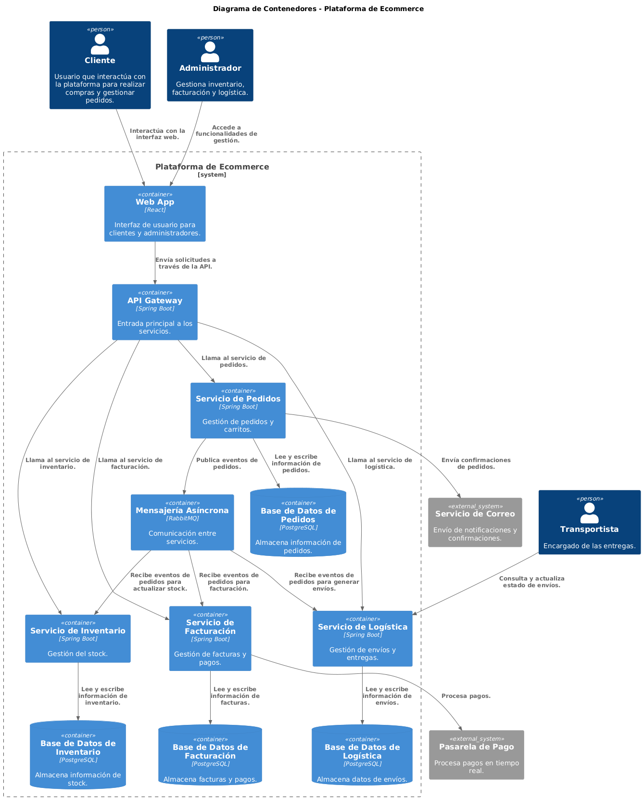
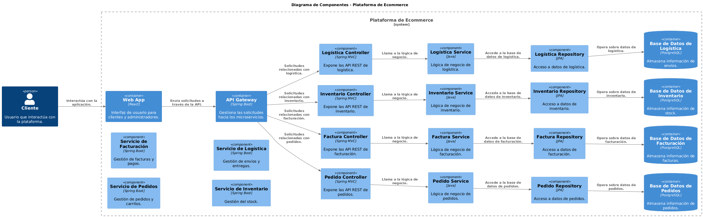

# Documento de Arquitectura de Software

## 1. Introducción y Metas
### Propósito
Este documento describe la arquitectura de una plataforma de ecommerce, estructurada siguiendo los principios de **Domain-Driven Design (DDD)** y alineada con la metodología Arc42. Su objetivo es proporcionar una visión clara de la arquitectura para los equipos técnicos y de negocio.

### Metas Arquitectónicas
- Facilitar la escalabilidad para soportar un crecimiento en el número de usuarios y pedidos.
- Garantizar la integridad y consistencia de los datos en diferentes bounded contexts.
- Promover un desarrollo modular y fácil mantenimiento utilizando **arquitectura hexagonal**.
- Cumplir con altos estándares de seguridad y cumplimiento normativo (por ejemplo, GDPR).

---
## 2. Contexto de Negocio
### Visión General
La plataforma permite a usuarios realizar compras en línea, gestionar pedidos, procesar facturas, controlar inventario y manejar la logística de envíos.

### Actores Externos
- **Usuarios**: Registrados y no registrados (clientes).
- **Transportistas**: Encargados de las entregas.
- **Sistemas de Pago**: Integraciones externas para procesar transacciones.
- **Administradores**: Gestionan inventario, facturación y logística.

---
## 3. Contexto Técnico
### Integraciones
1. **Pasarela de Pago**: Para procesar pagos en tiempo real.
2. **Correo Electrónico**: Servicios SMTP para notificaciones.
3. **ERP**: Para sincronización de inventario y reportes financieros.

### Diagrama de Contexto

####

Fuente del diagrama

[PlantUML](https://www.plantuml.com/plantuml/uml/VLN1RjGm4BtdAyoUjbA1Iqy8ePQq8AIAHhkj4AVLuCm6WsC7swbQK3-f9svSzySOnzwi5Q_IqsOyxyqRp_Fqt3emhczbyK8eBliQsTlox7LvjYcrSlZWtXN5zSNNcxlRpUrDjRcy-V9vUL8KJZY9x590Ow05HgYOhjbBLabmiDKc75nntRPeE1P5XSPgjUHI82MViaKPVYtevvtjmGZDVlN81CKCSBVx1unhnIImxi3PWG5c4AJu3OOHUsV0iaVMe7L2AufrM8jQsrUBatr9g5kXX7K6QcsesaNwxSj_Z62gVK-Il9HJjYKDFGaHkx-A2aZTx9ufZKF2J1JATjeC_TpkFuWQFEsLuc0QAk9lGf9CuZROmA1j_MWTjfkh1xVim8912HKqcc1L_FGe7_9KbT4SBRLFtvw7EO5jfuURcB1PDFU22rrgOz3phMF0yuLW47U_UnvYIZknfRueHQ6_IwxLLfWs1XBwzxfNDPZ7vM4WNjlnYIzEs9-2qLy63WCYv132Uc-VDwmAHoFq05_60SUC_T3yR6eSSHHUOUD7IurpK1pbE42BJIzQRpdVTMeJN-NfgDJH0reTa_iXiSYCvfWs5PsYWmiL-izu76kFvWxXu81vrQcBSz6VnjCPoOUaYUW4JIUUr6X94k57JtZhKwpJ_EUyGgdza0I7OmAlnvSs8v3iAp8R39uEDbWdqquT7JBJbnXbFXN52kLXFML-MuMbmqRx4gdjfGFsdNhHHeINc96aObTWgIum34Ap_DmmPIoIsi7ibK1pX2Dx_olaujlqcKVOT3Tcuq-t8yemMvBWnGGH1xFDSYPDfGiuROlQcUL8BtBTTxvDErvbjg6995tF6KCPBJ5Q8UsAKJ8LtlDa7QGRUxgTKr1Ye7mkWrjXicqdg-aSLUt_F_y7)

### Diagrama de Contenedores

####

Fuente del diagrama

[PlantUML](https://www.plantuml.com/plantuml/uml/ZLR1Sjis4BthAr2Vv9cqlUJOwKIMdOndb9gndSdqv5c1AmvQ4CikGATEfn_KWq-zzQeVAvQYJAr2LjK9WBZlOVSzBF0c9k3KrdxsZGlMjoMQ7vQllr--VbXIIE02ye-psMhnyyt7-uVxc-BXykRJJ_FpsIovvD5SEgWOQZ0vJW8mO4cCqNnh2Wy9DiIxFwyirJMonTciG8uKvjOxp06lpDboDphBmu-n1NPaVclHkBp6ODFs7p2MWl5WcW6p0GR32Dvz0JOPlM68vibK69EZaDSQB5r9yRkpypqbbBKBBYQ6aZYpBGxdGl-k3yxSZnYIREMLsO1DBODrsxz39l1KRP_pPnOEa3D4Y0rnby_zVfAXGM2lWWMkCebKmaCq6PknWcvlTqynOVrmzNkQDn21qKC15UMmefzAb2m9LC5aCKhw5GcEIGxhXhfA7A55v4Td7Is96GNlhbyGlDtYRdEFs-TkBL1o6sV1EWeejRGKDexhVa7Wz_WNr8OI-6a-A9AX9YG_EpT_p4p-lLXg_XdNYwR98PzmRV98DdABO9CChaNu3NmHaBOtH2TtRndPcf9ojpVD08rx1ma_mvC8NLoRVYO4TmsxK9aBehIhWC20aLNh6l06ZATezWKSGQ-TPIfs1ZkgRBywmjEvIqnKujwSKcHWTccIvEtUVHIEYDuU-F84MszXeHFZJ75T3wxNLCCV_qtaJKnaVvs0Nr7bkeDpXBvwEL4dqa2ngXHD7I35TBcUb-j1c0k8A96Na2WUgLDGJ1NZtOULp1Q-1elTqUySRBLI4qnQdMCsBT4qfPPdYakfewcqHFy_DwMMPZiKIvDfnQR9Ilbwa6t4TBdBjvX3tcE8y0lozXdC8cwVWsKA7VGjhDSklVyWuoNLRN2stttd07r4_vpDRj4F5yjBaxd--YPnVO-HZoHM0lNrC8GlhCKIJTQf3Q8qU5T2YLrkLM_F7aDT15-PFcSUMvyWwooATtUNoG2PJzUfWzhpgqxMTMimaRopBhMo2p2Pz77xb-n7KilDRWzn67hKibPUhctmBoLKNfy8rtOVWr2tvIIEil8ep701Ju6eoevYw9jQC7GD3Xl52b7QIhJirZZL0nICgeNk1AVW-XefF5KJTTXFe8sKwhWy-ZHFeoaJJgMg7odwGJ9UP_qG6KoidnSZTTOm-svHj6llB1YKj6aihljorBAtQ7FI8w6x1uOshmRJ6ft46auuzsrMuscDJiDL69213_LvWw5iQ_yl)

### Diagrama de Componentes

####

Fuente del diagrama

[PlantUML](https://www.plantuml.com/plantuml/uml/dPRFRkCs4CRlUWes9mVedyiUYs8TnvkwSB6kdMtHKp2c9YvHYbH9obktw0FriAVSUlMBbQGLZyKmNYP0WCWav_jnz8s6V6iT6DSrilf2A2wx6jctapVVJDxSJNJJQeNAVLTLy_6lxp_StisdxsxlbhERxsz7brNbX9F8hWLi33J0VEGn12txYYqaEBZNvZ0tvRffq72igWKQgzM8In6MViak9eUd2__umNPWX6P_TCY47pF0tVu_O5mh9e6rHyslBowhrSuwREwkTATgCBiHpNgbP_0Nb-plYZ7cDwiS28Lcz17NuxRr8R_Wclcdi8ybUd1uc8LDtCDVGQJhDzU20TPltx8TWxeHIbXdeDO6hTzQGe1Mt833Zx3pYkF5ZFM_0c3L6g4sx4hhoBj1wuHMm2HOPhKKNBYkzfZVW0i_gYrh13VQejdwEHrf0KTlVnGNBB0MjRQ1q2yDAVIZpu7t3ogiQkEga1e7OuIBb0HoM1DoD5fAD5xY8Cvex0Jpuy-Jy6lwPmYFoONti9okRWduBEMG0HAY7mYAFy0Mml_v_c4ZU3HRuKRxV0k4bzXgw_CpEzAciIY_68T_OyxHQkRbmMcRAETU_plWhZF0lPU91SSP_x8_uyFzOMameeLDBer-nS267l0Q7-vFzlOiZDpeIMLs5EkJ0OGeT2K1vAsPgQr_3bzouWnDdFT5Ckiq__rf0k8eC324T5_Z2OcU0v8fH2ltfOn17Wmn9TuaaBmpSxqHrWaEYJ5-VFyfJfmtXg7QxZ_5nkKr3MuWyyd8HyZ08qAynYDvZ3x38ui8LcvH4OAS65BA74eOmqFiUZsgrtIeN875478TOfEJPQ6jsnXS_JIF6Da0HmNU_tWSy-IKyQWCQTW_KrhQHCkGr53pJ2hf799cou7KA9xIgDWpCFAk54RL7t3_LDKI9TsnZdUSsTDB5RHIS6gP8Uvn-U3YCWtoCBYK07C6jlj_3zK3uPjub3WDpTmLLYSg1cKq6cgmSLDK6QdKeuFbMkc9a0fILohNf9YS8ZMOOi7ammkAJzzPUXUQIsY00PF-BsaPjB4aA7Fj2MsWneFEkg_3z9P3QcduQKzutw89zR4sUOKeaJ6m7tfXPcbK_xiujsnbP4IINfJFCjMAOldIej4N9fm9fA7Yj3F5crT9-c4kxKGhYcMh_pZumfJJE58gypazrHBPn6VgoFbq4wMtgEgkaVy3)

---
## 4. Estructura Arquitectónica
### Bounded Contexts
- **Pedidos**: Gestión de usuarios, carrito de compras, creación y cancelación de pedidos.
- **Facturación**: Generación de facturas, registro de pagos, notas de crédito.
- **Inventario**: Registro de stock, ajustes manuales, reportes.
- **Logística**: Creación de órdenes de envío, seguimiento y entrega.

---
## 5. Conceptos Arquitectónicos
### Patrones Clave
- **Arquitectura Hexagonal (Ports & Adapters)**: Para desacoplar lógica de negocio de implementaciones externas.
- **Domain-Driven Design**: Uso de agregados, entidades y servicios de dominio para modelar los bounded contexts.
- **Saga Pattern**: Para coordinar procesos distribuidos (por ejemplo, pedidos y facturación).

---
## 6. Escenarios Clave
### Caso de Uso: Registrar Pedido
1. Cliente selecciona productos y confirma el pedido.
2. Sistema verifica inventario y genera la orden.
3. Facturación crea una factura pendiente y el sistema envía notificación.

### Caso de Uso: Cancelar Pedido
1. Cliente solicita cancelación.
2. Sistema valida el estado del pedido.
3. Si es posible, cancela el pedido, actualiza inventario y notifica al cliente.

---
## 7. Estrategia de Implementación
### Tecnologías
- **Backend**: Java con Spring Boot.
- **Base de Datos**: PostgreSQL (Persistencia) y Redis (Cache).
- **Mensajería**: RabbitMQ para eventos entre bounded contexts.

### Despliegue
- Contenedores Docker orquestados con Kubernetes.
- Monitoreo con Prometheus y Grafana.

---
## 8. Decisiones Arquitectónicas (ADRs)
1. **Hexagonal Architecture como estilo arquitectónico**
2. **Estructura de paquetes para Arquitectura Hexagonal**
3. **Uso de ArchUnit para validar las reglas de arquitectura**
4. **Selección de Spring Boot como framework aplicativo**
5. **Elección de PostgreSQL como base de datos relacional**
6. **Selección de HTTP para tráfico North-South y gRPC para tráfico East-West**
7. **Mensajería Eventual**: RabbitMQ es el mecanismo para manejar comunicación asincrónica.
8. **Elección de Redis como caché distribuido**
9. **Elección de Maven como herramienta de construcción**
10. **Elección de Java 23 como versión del lenguaje y estrategia de actualización semestral**
11. **Elección de Jib para construir contenedores de aplicaciones Java**
12. **Elección de jMolecules para construir el modelo de dominio**
13. **Base de Datos Centralizada por Contexto**: Cada bounded context tiene su propia base de datos para asegurar autonomía.
14. **Elecciøn de herramienta para migraciones de base**
15. **Eleccion del mecanismo de seguridad en el trafico North-South**
16. **Eleccion del mecanismo de seguridad en el trafico East-West**
17. **Elecciøn herramienta definiciøn de contratos de trafico north-South**
18. **Elecciøn herramienta definiciøn de contratos de trafico east-west**
19. **lecciøn del framework de testing**
20. **Eleciøn de herramienta de mock de servicios externos**
21. **Eleccion de herramienta de CI/CD**
22. **Elecciøn plataforma de ejecucion**
23. **Eleciøøn de flujo de uso de Git (git flow)**
24. **Defiunicion de estandares de codificacion**
25. **Eleccion de ehrramienta para facilitar el uso de contenedores en pruebas de integracion**

---
## 9. Calidad y Requerimientos No Funcionales
- **Disponibilidad**: 99.9% SLA.
- **Escalabilidad**: Capacidad de manejar 10,000 transacciones concurrentes.
- **Seguridad**: Encriptación de datos sensibles y autenticación basada en OAuth 2.0.

---
## 10. Apéndices
### Glosario
- **Bounded Context**: Unidad lógica dentro del dominio modelado.
- **Saga Pattern**: Método para manejar transacciones distribuidas.

### Referencias
- Documentación técnica de Spring Boot.
- Principios de Arc42.
