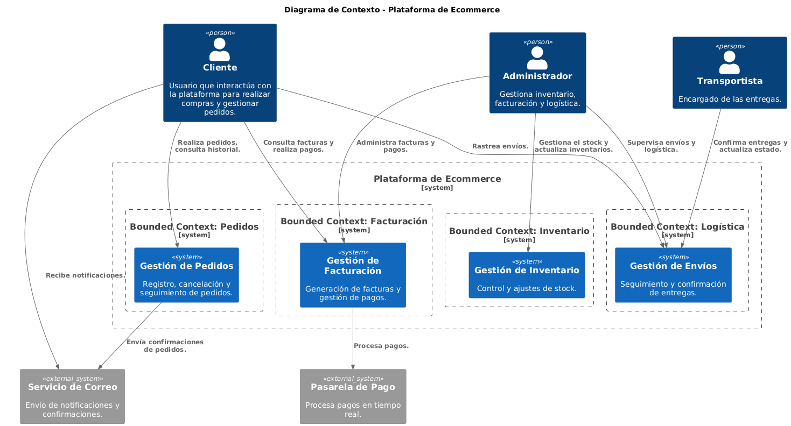

# Documento de Arquitectura de Software

## 1. Introducción y Metas
### Propósito
Este documento describe la arquitectura de una plataforma de ecommerce, estructurada siguiendo los principios de **Domain-Driven Design (DDD)** y alineada con la metodología Arc42. Su objetivo es proporcionar una visión clara de la arquitectura para los equipos técnicos y de negocio.

### Metas Arquitectónicas
- Facilitar la escalabilidad para soportar un crecimiento en el número de usuarios y pedidos.
- Garantizar la integridad y consistencia de los datos en diferentes bounded contexts.
- Promover un desarrollo modular y fácil mantenimiento utilizando **arquitectura hexagonal**.
- Cumplir con altos estándares de seguridad y cumplimiento normativo (por ejemplo, GDPR).

---
## 2. Contexto de Negocio
### Visión General
La plataforma permite a usuarios realizar compras en línea, gestionar pedidos, procesar facturas, controlar inventario y manejar la logística de envíos.

### Actores Externos
- **Usuarios**: Registrados y no registrados (clientes).
- **Transportistas**: Encargados de las entregas.
- **Sistemas de Pago**: Integraciones externas para procesar transacciones.
- **Administradores**: Gestionan inventario, facturación y logística.

---
## 3. Contexto Técnico
### Integraciones
1. **Pasarela de Pago**: Para procesar pagos en tiempo real.
2. **Correo Electrónico**: Servicios SMTP para notificaciones.
3. **ERP**: Para sincronización de inventario y reportes financieros.

### Diagrama de Contexto

---
## 4. Estructura Arquitectónica
### Bounded Contexts
- **Pedidos**: Gestión de usuarios, carrito de compras, creación y cancelación de pedidos.
- **Facturación**: Generación de facturas, registro de pagos, notas de crédito.
- **Inventario**: Registro de stock, ajustes manuales, reportes.
- **Logística**: Creación de órdenes de envío, seguimiento y entrega.

---
## 5. Conceptos Arquitectónicos
### Patrones Clave
- **Arquitectura Hexagonal (Ports & Adapters)**: Para desacoplar lógica de negocio de implementaciones externas.
- **Domain-Driven Design**: Uso de agregados, entidades y servicios de dominio para modelar los bounded contexts.
- **Saga Pattern**: Para coordinar procesos distribuidos (por ejemplo, pedidos y facturación).

---
## 6. Escenarios Clave
### Caso de Uso: Registrar Pedido
1. Cliente selecciona productos y confirma el pedido.
2. Sistema verifica inventario y genera la orden.
3. Facturación crea una factura pendiente y el sistema envía notificación.

### Caso de Uso: Cancelar Pedido
1. Cliente solicita cancelación.
2. Sistema valida el estado del pedido.
3. Si es posible, cancela el pedido, actualiza inventario y notifica al cliente.

---
## 7. Estrategia de Implementación
### Tecnologías
- **Backend**: Java con Spring Boot.
- **Base de Datos**: PostgreSQL (Persistencia) y Redis (Cache).
- **Mensajería**: RabbitMQ para eventos entre bounded contexts.

### Despliegue
- Contenedores Docker orquestados con Kubernetes.
- Monitoreo con Prometheus y Grafana.

---
## 8. Decisiones Arquitectónicas (ADRs)
1. **Hexagonal Architecture como estilo arquitectónico**
2. **Estructura de paquetes para Arquitectura Hexagonal**
3. **Uso de ArchUnit para validar las reglas de arquitectura**
4. **Selección de Spring Boot como framework aplicativo**
5. **Elección de PostgreSQL como base de datos relacional**
6. **Selección de HTTP para tráfico North-South y gRPC para tráfico East-West**
7. **Mensajería Eventual**: RabbitMQ es el mecanismo para manejar comunicación asincrónica.
8. **Elección de Redis como caché distribuido**
9. **Elección de Maven como herramienta de construcción**
10. **Elección de Java 23 como versión del lenguaje y estrategia de actualización semestral**
11. **Elección de Jib para construir contenedores de aplicaciones Java**
12. **Elección de jMolecules para construir el modelo de dominio**
13. **Base de Datos Centralizada por Contexto**: Cada bounded context tiene su propia base de datos para asegurar autonomía.

---
## 9. Calidad y Requerimientos No Funcionales
- **Disponibilidad**: 99.9% SLA.
- **Escalabilidad**: Capacidad de manejar 10,000 transacciones concurrentes.
- **Seguridad**: Encriptación de datos sensibles y autenticación basada en OAuth 2.0.

---
## 10. Apéndices
### Glosario
- **Bounded Context**: Unidad lógica dentro del dominio modelado.
- **Saga Pattern**: Método para manejar transacciones distribuidas.

### Referencias
- Documentación técnica de Spring Boot.
- Principios de Arc42.
